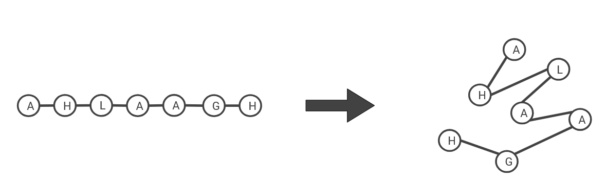
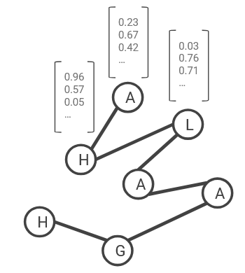

# JEPA_4_PLM

Ce projet explore l'application des architectures **JEPA** (Joint Embedding Predictive Architecture) au contexte des **Protein Language Models** (PLM), avec un accent particulier sur la régularisation des représentations latentes.

## Pourquoi ce projet

Les séquences protéiques peuvent etre vues comme un langage:

- les acides amines jouent le role de "tokens"
- les motifs biologiques jouent le role de structures syntaxiques/semantiques
- le contexte local et global d'une sequence porte de l'information fonctionnelle

Les PLM cherchent a apprendre des representations utiles de ces sequences, sans supervision explicite sur chaque residu. Les approches auto-supervisees sont donc centrales.

### De la séquence linéaire à la structure 3D



*Une séquence d'acides aminés linéaire (A-H-L-A-A-G-H) se replie en une structure tridimensionnelle complexe. Cette structure est critique pour la fonction biologique.*

## Particularite des architectures JEPA

Une architecture JEPA n'essaie pas de reconstruire pixel par pixel (ou token par token) l'entree. Elle apprend plutot a **predire une representation** de la cible dans un espace latent partage.

En pratique, on distingue generalement:

- un **encodeur de contexte** qui produit une representation du signal observe
- un **encodeur cible** (souvent stabilise par EMA) qui produit la representation de reference
- un **predictor** qui aligne la representation predite vers la representation cible

Cette formulation apporte plusieurs avantages:

- apprentissage de representations plus abstraites et robustes
- reduction du biais vers des details de reconstruction peu utiles
- meilleur alignement avec les objectifs de representation en biologie computationnelle

## Principe des Protein Language Models

Les PLM apprennent une fonction $f(seq)$ qui transforme une sequence d'acides amines en vecteurs latents riches. Ces vecteurs peuvent ensuite etre utilises pour:

- la prediction de structure ou de proprietes fonctionnelles
- la recherche de similarite entre proteines
- le transfert vers des taches aval (classification, regression, annotation)

L'idee cle est que la regularite statistique des grandes bases de sequences contient deja une partie importante de l'information biologique.

### Embedding des acides aminés



*Chaque acide aminé est transformé en un vecteur de nombres (embedding) qui capture son contexte et ses propriétés. Ces vecteurs denses servent de *tokens* pour le langage protéique.*

## Lien JEPA x PLM dans ce depot

Ce depot propose une base de travail pour combiner:

- un coeur de modele JEPA dans `src/JEPA/JEPA.py`
- des briques de regularisation dans `src/regularization/`
	- `VICReg.py` (variance, invariance, covariance)
	- esquisses autour de `SIGReg.py` et `WeakSIGReg.py`

Objectif de recherche: limiter les effondrements de representation (collapse) et favoriser des latents plus stables pour le domaine proteique.


## Installation

```bash
python -m venv venv
venv\Scripts\activate
pip install -r requirements.txt
```

## Etat actuel

Le projet est en phase exploratoire:

- l'ossature JEPA est presente
- la loss VICReg est implementee
- les variantes SIGReg/WeakSIGReg sont en cours de conception

## Perspectives

- integrer un pipeline de donnees proteiques reproductible
- ajouter une boucle d'entrainement complete et des metriques de suivi

## Références

- **LeJEPA** : Assran, M., Caron, M., Misra, I., Bojanowski, P., Bordes, F., Vincent, P., & Joulin, A. (2023). *Masked Autoencoder are Scalable Vision Learners*. CVPR.

- **I-JEPA** : Bardes, A., Ponce, J., & LeCun, Y. (2022). *VICReg: Variance-Invariance-Covariance Regularization for Self-Supervised Learning*. ICCV.

- **VICReg** : Bardes, A., Ponce, J., & LeCun, Y. (2021). *Exploring Simple Vision Transformers with Masked Image Modeling*. arXiv:2104.14294.
